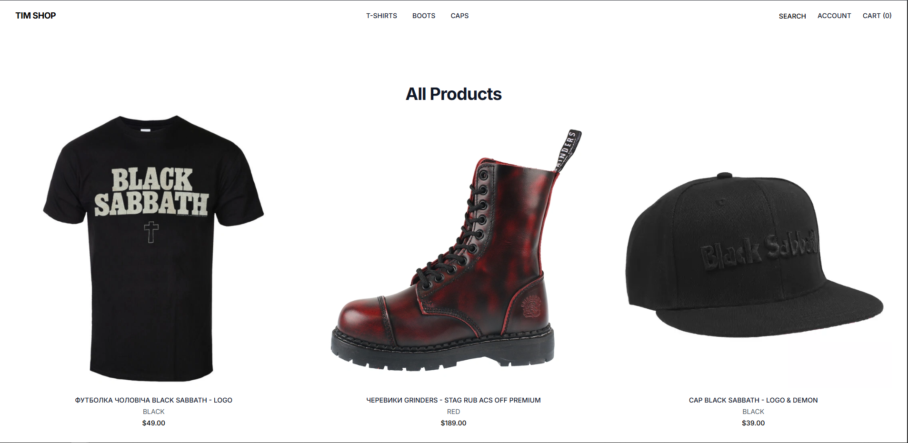

# Modern Django E-commerce App (with HTMX)

An interactive, no-page-reload e-commerce platform built with **Django**, **HTMX**, and **TailwindCSS**.  
Fully dynamic user experience with a traditional Django backend.

---

## ⚙️ Tech Stack

- 🐍 Django
- ⚡ HTMX — dynamic UI without JavaScript frameworks
- 🎨 TailwindCSS — modern styling
- 💳 Stripe — secure payments integration
- 🔐 Custom authentication with email login
- ❤️ Wishlist (AJAX-powered with HTMX)
- 🛒 Shopping cart with live updates
- 📦 Orders, profiles, account management

---

## ✨ Features

- Responsive product catalog with categories and filtering
- Product detail pages with variants (e.g., size)
- Add to cart & update quantities (HTMX)
- Checkout and order summary
- Stripe integration with webhooks
- Profile page with tabbed navigation:
  - Account info editing
  - Order history
  - Wishlist
- Wishlist with instant toggle (HTMX-based)
- CSRF protection and secure form handling
- HTMX partials + full templates for seamless reload & SPA-feel

---

for local stripe testing:
run cli https://docs.stripe.com/stripe-cli/install

stripe login
stripe listen --forward-to localhost:8000/payment/stripe/webhook/